# ComplyDesk — system architecture

ComplyDesk is a multi-tenant statutory-compliance helpdesk. Employees of a
client company raise queries about PF, ESIC and related matters; ComplyDesk's
own staff work them; the client's partners oversee the entities they are
accountable for. Everything else in this document follows from that sentence —
in particular, that **two different companies' data sit in the same database and
must never meet**.

> Companion documents: [WORKFLOWS.md](WORKFLOWS.md) for the process flows,
> [DATABASE.md](DATABASE.md) for the schema, [API.md](API.md) for the wire
> contract, [TEST_LOGINS.md](TEST_LOGINS.md) for credentials to try them with.

---

## 1. The shape of the system

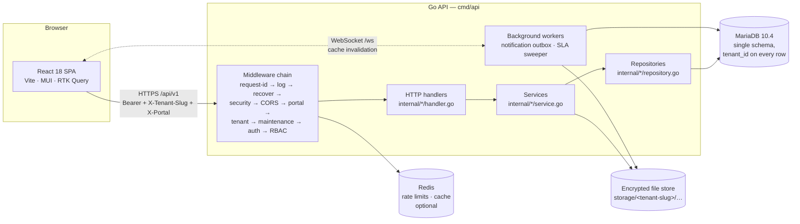

**One Go binary, one database, one SPA.** There is no service mesh and no
message broker: the notification outbox is a table, the scheduler is a
goroutine, and the cache is optional. That is a deliberate choice for a system
whose load is measured in tickets per day rather than requests per second — the
operational surface is small enough that a single operator can reason about it.

### Layering, and what each layer is allowed to know

| Layer | Package shape | Knows about | Must not |
|---|---|---|---|
| Transport | `internal/*/handler*.go` | HTTP, JSON, permissions, request scope | contain business rules or SQL |
| Service | `internal/*/service.go` | business rules, cross-repository orchestration | know about `http.Request` |
| Repository | `internal/*/repository*.go` | SQL, transactions, row mapping | decide who may do what |
| Platform | `internal/platform` | DB pools, ULIDs, paging, crypto, errors | know about any domain |

The rule that matters most: **a repository never receives a `*http.Request` and
a handler never writes a `JOIN`.** Where that is broken it is visible and
deliberate (the ticket handler resolves a few public ids inline), and it is
flagged in the code.

### Request identity, in one object

Every authenticated request carries an `appctx.Actor`: user id, tenant, roles,
permission set, portal, and the *reach* — the set of client workspaces this
caller may touch. Every scoping decision in the system reads that one object, so
"who is this and what may they see" has exactly one answer per request.

---

## 2. Multi-tenancy and client isolation

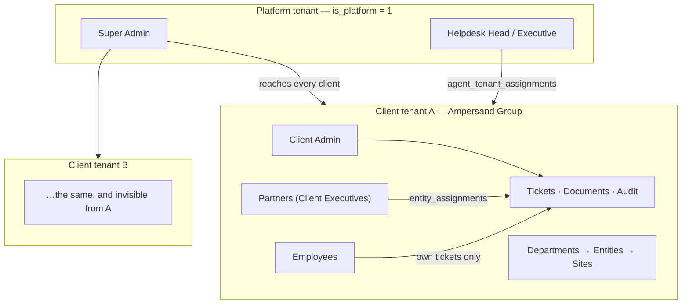

**Isolation is enforced by row, not by connection.** There is one schema; every
tenant-owned table carries `tenant_id`, and every query filters on it. Three
mechanisms combine:

1. **Tenant resolution.** `X-Tenant-Slug`, the URL's client code, or a custom
   domain resolves to one tenant before authentication runs. A token minted for
   one workspace is rejected against another.
2. **Reach.** Staff live in the *platform* tenant, not inside a client, so a
   pinned `tenant_id` filter would find nothing for them. `appctx.Reach`
   translates a caller into the list of client tenant ids they may act in:
   every client for a super admin, every client for an agent with no
   assignments, and exactly the assigned clients otherwise.
3. **Scope.** Within a client, `user_scopes`, `entity_assignments`,
   `site_assignments` and `department_assignments` narrow further — a partner
   allocated to one entity sees that entity's tickets and no others.

The isolation guarantee is that **every one of those narrowings is applied in
SQL**, not in a handler and never in the browser. A response that a caller
should not see is not filtered out late; the rows are never selected.

Cross-tenant reads that are legitimate — an agent opening a ticket from the
cross-client queue — are resolved "in reach" and then authorised against the
record's *own* tenant, and the audit row is stamped `cross_tenant = 1`.

---

## 3. Portals

One SPA, four faces. The portal is a first-class concept: it is sent as
`X-Portal`, stamped on the session, and checked at login, because the same
person must not be able to reach the admin console with a credential issued for
the employee portal.

| Portal | URL | Who | Sees |
|---|---|---|---|
| `admin` | `/admin` | Super Admin | every client, every configuration surface |
| `agents` | `/agents` | Helpdesk Head, Helpdesk Executive | the clients they are assigned to |
| `partner` | `/{CODE}/partners` | Client Admin, Client Executive | their client; partners, their entities |
| `user` | `/{CODE}/user` | Employees and ex-employees | their own tickets only |

A role declares which portal it belongs to (`roles.portal`), and login refuses a
mismatch with `PORTAL_MISMATCH` rather than a vague failure.

---

## 4. Request lifecycle

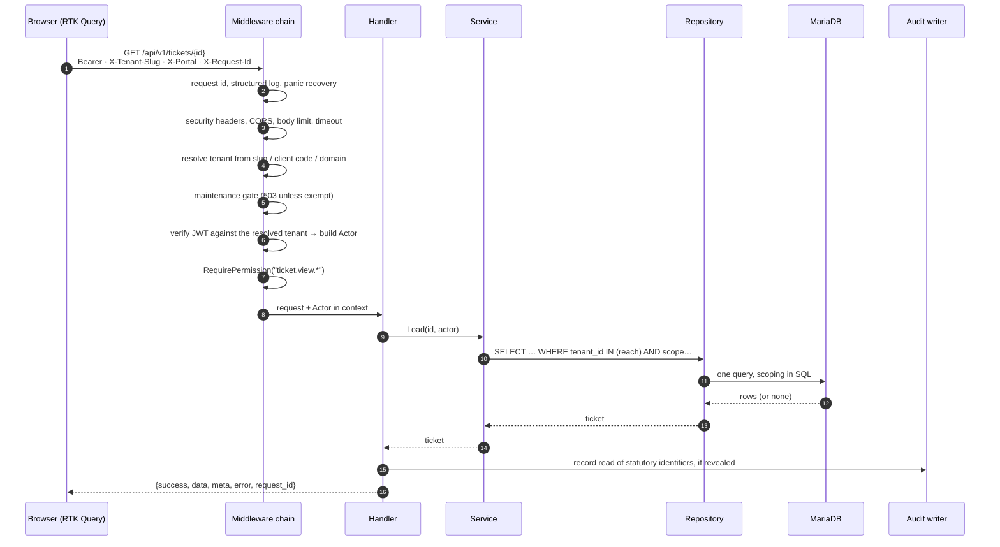

**Middleware order is load-bearing** and documented as such in
`internal/app/router.go`: correlation before anything that can fail, recovery
before anything that can panic, security headers before any body is written,
tenant before maintenance (which needs it), authentication before authorisation.

### The envelope

Every response, success or failure, has the same shape:

```json
{ "success": true, "data": {}, "meta": null, "error": null, "request_id": "…" }
```

`request_id` is echoed from `X-Request-Id` or generated, appears in every log
line and every audit row, and is the single handle for tracing one user action
end to end.

---

## 5. Authentication, sessions and 2FA

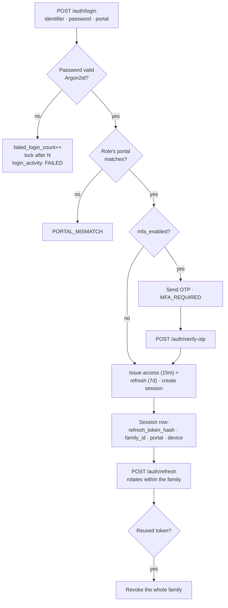

- **Passwords**: Argon2id with per-deployment parameters; history retained in
  `password_history` so a reset cannot reuse the last N.
- **Access tokens**: short-lived JWTs carrying user, tenant and portal. Never
  stored where JavaScript from another origin could reach them.
- **Refresh tokens**: hashed at rest, rotated on every use, grouped by
  `family_id`. Presenting a rotated token revokes the family — the standard
  detection for a stolen refresh token.
- **OTP**: hashed, single-use, attempt-capped, with a TTL.
- **Sessions**: enumerable and revocable by the user and by an administrator;
  concurrent sessions are capped by configuration.

Every attempt, successful or not, writes `login_activity`.

---

## 6. Authorisation (RBAC + scope)

Authorisation answers three questions in order, and all three must pass.

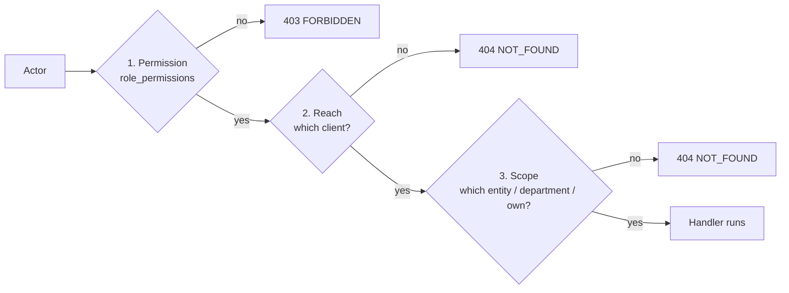

- **Permission** is a flat key — `ticket.assign`, `user.view.pii`,
  `document.upload` — granted to roles, and roles to users. Route middleware
  checks it before the handler is entered.
- **Reach** is the client-tenant question, and a failure is reported as
  **NOT_FOUND, not FORBIDDEN**: confirming that another client's ticket exists
  is itself a disclosure.
- **Scope** is the within-client question. `ticket.view.own` sees your own
  tickets; `ticket.view.scope` sees your entities' or department's;
  `ticket.view.all` sees the client's.

Where a rule is needed in two places — the picker that offers a choice and the
endpoint that accepts it — it is written **once** and shared, because two
implementations drift and the drift shows up as an option that exists to be
rejected. `user.worksDepartment` is the current example: it decides both which
agents the assign dialog lists and which the assign endpoint accepts.

---

## 7. Ticketing engine

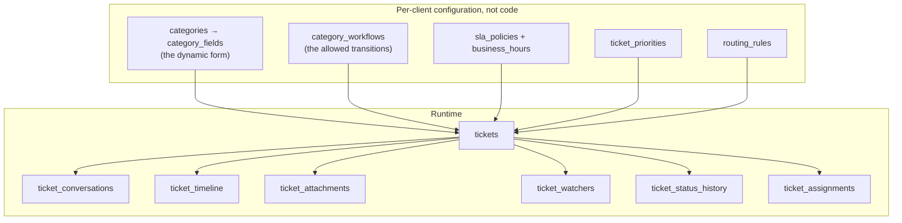

The lifecycle is **configuration, not code**. `GET /tickets/{id}` returns
`allowed_transitions` computed from `category_workflows` for the caller's roles,
and the action bar renders from that list — so a client with a different
lifecycle needs no frontend change, and the browser never holds a copy of the
rules it could get wrong.

Every mutation writes its audit trail **inside the same transaction** as the
change (`writeTimeline`), so the log cannot disagree with the ticket.

Ticket numbers are `{CLIENT_CODE}-{CATEGORY_PREFIX}-{YEAR}-{000001}`, allocated
under a row lock on `ticket_sequences` so two simultaneous creates cannot
collide and the sequence cannot skip — support staff read gaps as lost tickets.

---

## 8. Document storage

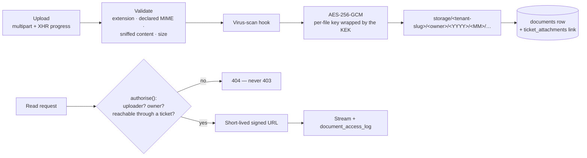

- Files live **outside the database**, under a path that begins with the tenant
  slug, so a mis-scoped read fails at the filesystem as well as in SQL.
- Files are encrypted at rest with a per-file key wrapped by a master key; the
  key id and nonce are on the row.
- ``, `<iframe>` and pdf.js cannot send an `Authorization` header, so
  previews use short-lived **signed URLs** rather than putting a bearer token in
  a URL bar or a `Referer`.
- Every read is written to `document_access_log`.
- A document is reachable **through the tickets it is attached to**. That single
  rule is why attaching matters: a file that was uploaded but never linked is
  authorised against an empty set of tickets and is therefore unreachable — the
  defect behind "supporting documents are not visible in the created ticket",
  fixed in migration `000025` and in `internal/ticket/repository_form_files.go`.

---

## 9. Notifications and realtime

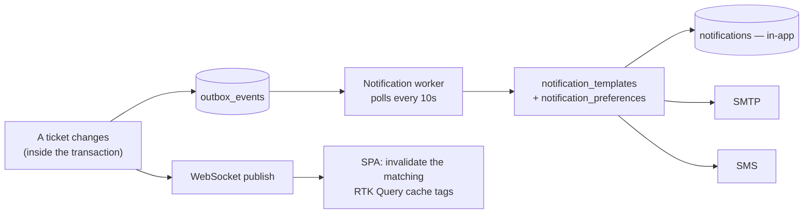

The **transactional outbox** is what makes "the ticket moved but nobody was
told" impossible: the event row is written in the same transaction as the
change, and the worker delivers it afterwards with retries and a
`published_at` watermark.

The WebSocket carries **cache invalidation, not data**: a `ticket.updated`
message names the ticket, the SPA invalidates that tag, and RTK Query refetches
through the ordinary authorised endpoint. A socket that carried payloads would
be a second authorisation surface to get right.

The list screens do not depend on the socket being up: they refetch on mount, on
window focus, and on a poll, and the ticket action endpoints write their own
response into the cache so a change is visible immediately rather than at the
next poll.

---

## 10. Audit logging

`audit_logs` is separate from `ticket_timeline` and answers a different
question.

| | `ticket_timeline` | `audit_logs` |
|---|---|---|
| Audience | the people on the ticket | compliance and security |
| Content | what happened, in prose | before/after payloads, IP, user agent, portal, request id |
| Scope | one ticket | every entity type |
| Retention | with the ticket | independent, hash-chained |

Rows carry `prev_hash` and `row_hash`, so the chain is verifiable and a deletion
or edit is detectable. `cross_tenant` marks a staff action taken inside a client
workspace.

**The timeline is the readable version of the audit trail, not a replacement for
it.** The UI renders the event as a sentence — "Ticket reopened · Closed →
Reopen · Reason: Not resolved" — while the full technical record stays in
`audit_logs`. Neither the status codes nor the raw payload reach the screen.

---

## 11. Error handling and validation

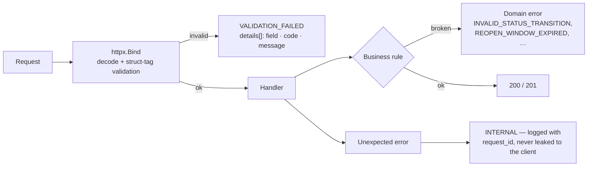

- **One error shape.** `{code, message, details[]}`. `details` is per-field, so
  the SPA can map a server rejection onto the exact form control.
- **Messages are written for the person reading them**, not for the developer:
  "This ticket is already with that department and agent. Choose a different
  department, or a different agent within it."
- **Fail closed.** Authorisation helpers are written so that every branch is a
  reason to *allow* and falling off the end is a refusal.
- **NOT_FOUND over FORBIDDEN** wherever confirming existence would itself
  disclose something.
- **Idempotency.** Creates and uploads accept an `Idempotency-Key`; a retry
  after a network blip returns the original result rather than a duplicate.

---

## 12. Frontend architecture

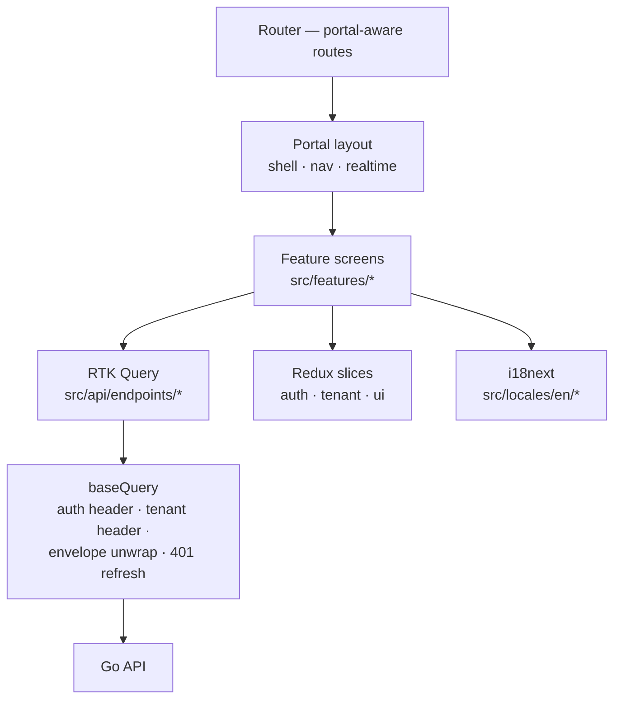

- **Server state lives in RTK Query, not in Redux slices.** Slices hold session,
  tenant and UI preferences; everything else is a cache entry with a tag.
- **Tag discipline** is the refresh contract: a tag is invalidated by the
  mutation that changes it *and* by the matching WebSocket event, so a change
  made by somebody else refreshes the same queries as a change made here.
- **URL is the state** for list screens — filters, sort and page — so any view
  is shareable and the back button behaves.
- **Responses are validated in dev** against zod schemas that log drift and
  return the payload unchanged, so a backend change degrades the console rather
  than the screen. In production the check compiles away.
- **Permissions gate rendering, never data.** `PermissionGate` hides a control
  the caller cannot use; the server refuses it regardless.

---

## 13. Deployment topology

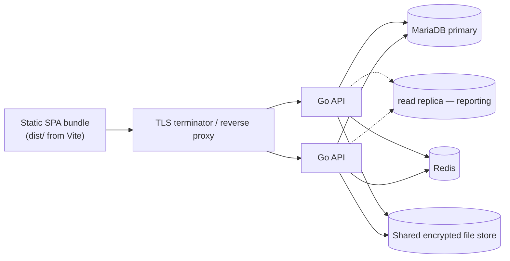

The API is stateless apart from the file store, so it scales horizontally. The
two background workers are safe to run on every instance — the outbox claims
rows before publishing and the SLA sweeper's events are unique per
`(ticket, event, level)`.

`/health` answers always; `/ready` reports dependency checks and is what a load
balancer should watch. Prometheus metrics are exposed when enabled.

---

## 14. Keeping this document true

Update it in the same change that alters what it describes:

| If you change… | Update |
|---|---|
| a table, a column, a foreign key | [DATABASE.md](DATABASE.md) |
| a route, a payload, an error code | [API.md](API.md) |
| a process a person follows | [WORKFLOWS.md](WORKFLOWS.md) |
| a layer, a boundary, a security control | this file |

Diagrams are Mermaid so they are diffable and reviewable in the pull request
that changes them. A diagram that has to be re-exported from a drawing tool
stops being updated within about two sprints.
