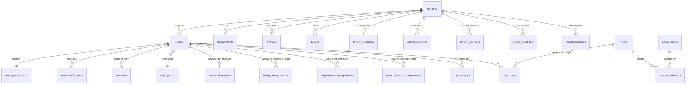
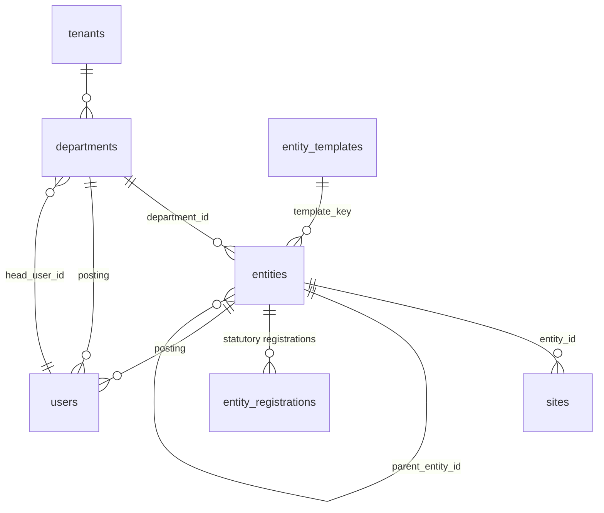
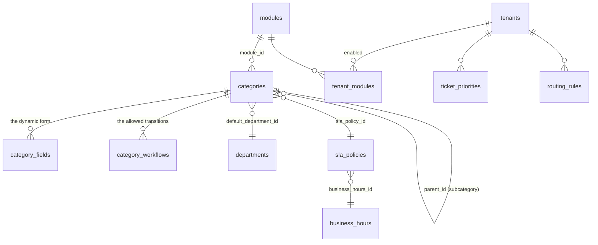
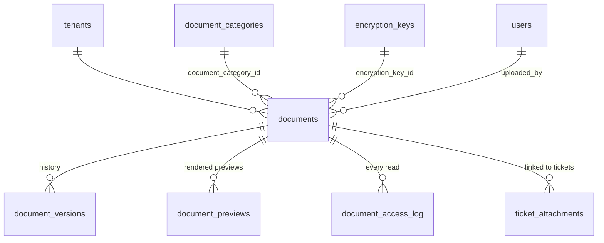
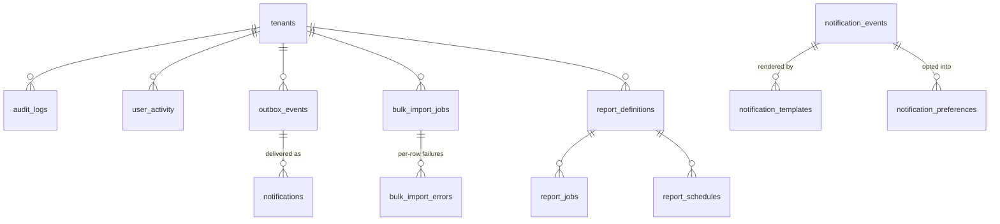

# ComplyDesk — database schema

MariaDB 10.4, InnoDB, `utf8mb4` / `utf8mb4_general_ci`. One schema, 78 tables,
migrated with `golang-migrate` from `db/migrations` and applied with
`go run ./cmd/cli migrate up`.

> Companions: [ARCHITECTURE.md](ARCHITECTURE.md) for how the data is reached,
> [WORKFLOWS.md](WORKFLOWS.md) for what moves it, [API.md](API.md) for the wire
> shapes.

---

## Conventions that hold everywhere

| Convention | Why |
|---|---|
| `id BIGINT UNSIGNED AUTO_INCREMENT` is the internal key | narrow, ordered, good for InnoDB clustering |
| `public_id CHAR(26)` is the **ULID** used on the wire | an id in a URL never reveals row counts or ordering; every API path and payload uses it |
| `tenant_id` on every tenant-owned table | isolation is by row; every query filters on it |
| `deleted_at DATETIME(3) NULL` = soft delete | a helpdesk that can erase a request loses the record that it was made |
| `created_at` / `updated_at` are `DATETIME(3)` UTC | millisecond precision; the app converts to the tenant's timezone |
| `*_json LONGTEXT` with a `json_valid` CHECK | MariaDB 10.4 has no native JSON type; the constraint gives the same guarantee |
| `is_active TINYINT(1)` = switched on | distinct from soft delete: retired but retained |
| Unique keys are `(tenant_id, …)` | two clients may both have a department called "PF" |

**Reading the diagrams.** `||--o{` is one-to-many, `}o--||` many-to-one,
`||--||` one-to-one. Only the relationships that matter are drawn; the full
column list for each table is in the reference below.

---

## 1. Core — tenants, users, roles



### `tenants`

The client company, and — with `is_platform = 1` — ComplyDesk itself. Root of
every isolation rule.

| Column | Type | Notes |
|---|---|---|
| `id` | BIGINT UNSIGNED | **PK** |
| `public_id` | CHAR(26) | UNIQUE, ULID |
| `slug` | VARCHAR(64) | UNIQUE — resolves the workspace from a URL or header |
| `client_code` | VARCHAR(32) | UNIQUE — the human handle, e.g. `AMP`; appears in ticket numbers |
| `name`, `legal_name`, `industry` | VARCHAR | |
| `status` | VARCHAR(20) | `ACTIVE` / `SUSPENDED` / `ARCHIVED` |
| `is_platform` | TINYINT(1) | 1 for ComplyDesk's own workspace, where staff live |
| `timezone`, `locale`, `date_format` | VARCHAR | drive SLA calculation and display |
| `ticket_prefix` | VARCHAR(12) | fallback when a category has none |
| `contact_*`, `alt_*`, `address`, `tax_id` | | |
| `contract_start`, `contract_end` | DATE | |
| `retention_policy_json` | LONGTEXT | per-client retention |
| `account_manager_id`, `created_by` | BIGINT | → `users.id` |
| `onboarded_at`, `created_at`, `updated_at`, `deleted_at` | DATETIME(3) | |

Indexes: `(status)`, `(is_platform, status)`.

### `users`

Everybody: employees, partners, agents, administrators. One table, because the
same person can hold more than one role and the difference is the role, not the
record.

| Column | Type | Notes |
|---|---|---|
| `id` | BIGINT UNSIGNED | **PK** |
| `public_id` | CHAR(26) | UNIQUE, ULID |
| `tenant_id` | BIGINT | **FK** → `tenants.id` CASCADE. Staff carry the *platform* tenant |
| `employee_code`, `username`, `email`, `alt_email`, `mobile`, `alt_mobile` | | UNIQUE per tenant where applicable |
| `first_name`, `last_name`, `designation` | VARCHAR | |
| `pan_number`, `uan_number`, `pf_number`, `esic_number` | VARCHAR | statutory identity; **PII**, masked until revealed and the reveal is audited. `pf_number` and `uan_number` are UNIQUE per tenant |
| `date_of_joining`, `date_of_birth` | DATE | DOJ is mandatory for an employee raising a ticket |
| `last_working_day` | DATE | non-null ⇒ **ex-employee**. Separate from `status` |
| `entity_id`, `site_id`, `department_id` | BIGINT | **FK**, `ON DELETE SET NULL` — the person's posting |
| `user_group_id` | BIGINT | **FK** → `user_groups.id` |
| `handling_agent_id` | BIGINT | **FK** → `users.id` — who follows up for an ex-employee |
| `employment_changed_at/_by` | | who moved them and when |
| `status` | VARCHAR(20) | `ACTIVE` / `INACTIVE` — account access, *not* employment |
| `password_hash`, `password_algo` | | Argon2id; NULL until activation |
| `must_change_password`, `password_changed_at`, `password_expires_at` | | |
| `failed_login_count`, `locked_until` | | brute-force lockout |
| `mfa_enabled`, `mfa_secret_enc`, `mfa_recovery_json` | | secret encrypted at rest |
| `last_login_at`, `login_count`, `avatar_path`, `locale`, `timezone` | | |
| `custom_fields_json` | LONGTEXT | per-client extras |

Indexes: `(tenant_id, status)`, `(tenant_id, entity_id)`,
`(tenant_id, department_id)`, `(tenant_id, user_group_id)`,
`(tenant_id, last_working_day)`, `(tenant_id, handling_agent_id, status)`,
plus name, mobile, email and PAN lookups.

### `roles`, `permissions`, `role_permissions`, `user_roles`

| Table | PK | Purpose |
|---|---|---|
| `roles` | `id` | `role_key` UNIQUE per tenant; `tenant_id NULL` = system role. `portal` decides which portal the role may sign in to. `alias_of` supports renames without breaking grants |
| `permissions` | `permission_key` | flat keys grouped by `permission_group`. The catalogue, not per tenant |
| `role_permissions` | `(role_id, permission_key)` | the grant, both FKs CASCADE |
| `user_roles` | `(user_id, role_id)` | plus `granted_by`, `created_at` |

### Scope tables

| Table | Key | Answers |
|---|---|---|
| `user_scopes` | UNIQUE `(user_id, scope_type, scope_id)` | generic narrowing — `scope_type` names the dimension |
| `agent_tenant_assignments` | UNIQUE `(agent_user_id, tenant_id)` | which **clients** a staff member reaches. `revoked_at` retires without deleting. No rows ⇒ reaches every client |
| `department_assignments` | `(tenant_id, department_id, user_id)` | which **statutory lines** an agent works. No rows and no `users.department_id` ⇒ a generalist, eligible everywhere |
| `entity_assignments` | `(tenant_id, entity_id, user_id)` | which **entities** a partner oversees; `can_reply` grants per-entity reply rights |
| `site_assignments` | `(tenant_id, site_id, user_id)` | location-level scope |

### Session and credential tables

| Table | Notes |
|---|---|
| `sessions` | `refresh_token_hash` UNIQUE, `family_id` for rotation-reuse detection, `portal`, device fingerprint, `revoked_at` + `revoked_reason` |
| `otp_codes` | hashed, `purpose`, `attempts` cap, TTL, `consumed_at` |
| `password_reset_tokens` | hashed; `token_type` distinguishes `RESET` from `ACTIVATION` |
| `password_history` | prevents reuse of the last N |
| `login_activity` | every attempt, successful or not — `result`, IP, agent, portal |

---

## 2. Organisation — Client → Department → Entity → Site



| Table | Key columns | Notes |
|---|---|---|
| `departments` | `code` UNIQUE per tenant, `name`, `type` (`PF`, `ESIC`, `GENERAL`…), `head_user_id`, `is_active` | the statutory line. `type` drives defaults |
| `entities` | `code` UNIQUE per tenant, `name`, `type`, **`department_id`**, `parent_entity_id`, `template_key`, `cin_number`, `gst_number`, `is_default`, `opted_out_at/_by` | the establishment. **Belongs to exactly one department** — the constraint the ticket form and the create endpoint both check |
| `sites` | `entity_id`, `code`, `name`, address, `is_default` | a physical location |
| `entity_registrations` | `entity_id`, `category_id`, `registration_number`, `registered_on`, `valid_until` | the statutory registration an entity holds for a query type |
| `entity_templates` | `template_key`, `entity_type`, `default_categories_json` | platform-level blueprints used at onboarding |

---

## 3. Catalogue — what a client can raise, and how it moves



| Table | Key columns | Notes |
|---|---|---|
| `categories` | `category_key` , `name`, `parent_id`, `is_subcategory`, `ticket_prefix`, `sla_policy_id`, **`default_department_id`**, `module_id`, `icon`, `color`, `is_active`, `sort_order` | the query domain. Copied **per client**, so one client can retire a type without affecting another. `default_department_id` is what scopes the create form's catalogue to the chosen department |
| `category_fields` | UNIQUE `(category_id, field_key)`, `field_type`, `is_required`, `options_json`, `validation_json`, `depends_on_json`, `sort_order` | the dynamic form. `field_type` ∈ TEXT, TEXTAREA, NUMBER, DATE, SELECT, MULTISELECT, CHECKBOX, RADIO, **FILE**, EMAIL, PHONE, CURRENCY. **A subcategory carries no fields of its own and inherits its parent's** |
| `category_workflows` | `from_status`, `to_status`, `allowed_roles_json`, `requires_comment`, `requires_reason_code`, `reason_codes_json`, `auto_after_hours`, `label` | the lifecycle as data. `GET /tickets/{id}` renders `allowed_transitions` from this |
| `ticket_priorities` | `priority_key` UNIQUE per tenant, `weight`, `colour`, `is_default`, `is_active` | a catalogue, not an enum — see [WORKFLOWS §12](WORKFLOWS.md#12-priority) |
| `sla_policies` | `category_id`, `priority`, `user_group_id`, `first_response_mins`, `resolution_mins`, `business_hours_id`, `escalation_json`, `pause_on_statuses_json` | matched most-specific-first |
| `business_hours` | `schedule_json`, `holidays_json`, `timezone` | so "4 working hours" means what the contract says |
| `routing_rules` | `conditions_json`, `action`, `target_id`, `priority_order`, `stop_on_match` | auto-assignment at creation |
| `modules` / `tenant_modules` | `module_key`, `enabled`, `config_json` | which product areas a client has bought |

**The FILE field type is load-bearing.** Its value is a document `public_id` (or
a list of them), and those documents are linked into `ticket_attachments` on
create and on update — see §5 and migration `000025`.

---

## 4. Tickets

```mermaid
erDiagram
    tickets }o--|| tenants : "tenant_id"
    tickets }o--|| categories : "category_id"
    tickets }o--o| categories : "subcategory_id"
    tickets }o--|| users : "requester_id"
    tickets }o--o| users : "assignee_id"
    tickets }o--o| entities : "entity_id"
    tickets }o--o| sites : "site_id"
    tickets }o--o| departments : "department_id"
    tickets }o--o| sla_policies : "sla_policy_id"
    tickets }o--o| tickets : "parent_ticket_id"

    tickets ||--o{ ticket_conversations : "thread"
    tickets ||--o{ ticket_timeline : "activity"
    tickets ||--o{ ticket_status_history : "status audit"
    tickets ||--o{ ticket_assignments : "handover audit"
    tickets ||--o{ ticket_attachments : "files"
    tickets ||--o{ ticket_watchers : "followers"
    tickets ||--o{ ticket_sla_events : "clock events"
    tickets ||--o{ ticket_feedback : "CSAT"
    ticket_conversations ||--o{ ticket_attachments : "conversation_id"
    ticket_conversations ||--o{ ticket_conversation_reads : "read receipts"
    documents ||--o{ ticket_attachments : "document_id"
    tenants ||--o{ ticket_sequences : "numbering"
```



### `tickets`

The centre of the system.

| Column | Type | Notes |
|---|---|---|
| `id` | BIGINT UNSIGNED | **PK** |
| `public_id` | CHAR(26) | UNIQUE, ULID — what the API and the URL use |
| `tenant_id` | BIGINT | **FK** → `tenants.id` CASCADE |
| `ticket_number` | VARCHAR(48) | UNIQUE per tenant. `{CLIENT_CODE}-{PREFIX}-{YEAR}-{000001}` |
| `category_id` | BIGINT | **FK** → `categories.id` (no cascade — a category in use cannot be deleted) |
| `subcategory_id` | BIGINT | **FK** → `categories.id` SET NULL |
| `subject` | VARCHAR(255) | |
| `description` | MEDIUMTEXT | sanitised HTML |
| `status` | VARCHAR(24) | `NEW`, `PENDING_HELPDESK`, `PENDING_EMPLOYEE`, `CLOSED`, `REOPENED`, `CANCELLED` |
| `priority` | VARCHAR(16) | a key from the client's `ticket_priorities` |
| `source` | VARCHAR(16) | `PORTAL`, `EMAIL`, `PHONE`, `API` |
| `requester_id` | BIGINT | **FK** → `users.id` (no cascade — the ticket outlives the account) |
| `requester_snapshot_json` | LONGTEXT | identity **frozen at creation**, so a later profile edit cannot rewrite history |
| `entity_id`, `site_id`, `department_id` | BIGINT | **FK** SET NULL — the routing chain |
| `assignee_id` | BIGINT | **FK** → `users.id` SET NULL |
| `custom_fields_json` | LONGTEXT | the category's own fields, keyed by `field_key` |
| `sla_policy_id` | BIGINT | **FK** SET NULL — the policy matched at creation |
| `first_response_due_at`, `resolution_due_at`, `first_responded_at` | DATETIME(3) | the SLA clocks |
| `resolved_at`, `closed_at` | DATETIME(3) | `resolved_at` is what the reopen window and the CSAT prompt count from |
| `reopened_count`, `last_reopened_at` | | |
| `escalation_level` | INT | **a flag alongside the status, never a replacement for it** |
| `is_sla_breached`, `sla_paused_at`, `sla_paused_total_mins` | | pause accrual for `PENDING_EMPLOYEE` |
| `csat_score`, `csat_comment` | | denormalised from `ticket_feedback` for list sorting |
| `parent_ticket_id` | BIGINT | **FK** self, SET NULL — linked tickets |
| `last_activity_at` | DATETIME(3) | the default list sort |
| `created_by`, `updated_by` | | `created_by ≠ requester_id` ⇒ raised on behalf |

Indexes: `(tenant_id, status, created_at)`, `(tenant_id, assignee_id, status)`,
`(tenant_id, requester_id, status)`, `(tenant_id, category_id, status)`,
`(tenant_id, entity_id, status)`, `(tenant_id, department_id, status)`,
`(tenant_id, site_id, status)`, `(tenant_id, subcategory_id, status)`,
`(tenant_id, status, resolution_due_at)`,
`(tenant_id, first_responded_at, first_response_due_at)`,
`(tenant_id, last_activity_at)`, `(tenant_id, created_at)`, and a **FULLTEXT**
on `(subject, description)`.

### Ticket child tables

| Table | Primary/unique key | Purpose and notable columns |
|---|---|---|
| `ticket_conversations` | `id`, `public_id` UNIQUE | the thread. `visibility` (`PUBLIC` / `INTERNAL`) is filtered **in SQL**, `body_html` + `body_text`, `author_role` snapshot, `in_reply_to_id`, `mentions_json`, `email_message_id`, `edited_at`, `deleted_at` |
| `ticket_conversation_reads` | `(conversation_id, user_id)` | per-user read receipts |
| `ticket_attachments` | **UNIQUE `(ticket_id, document_id)`** | the link that makes a document reachable. `conversation_id` NULL ⇒ it arrived with the ticket itself; `context` ∈ `REQUESTER` / `AGENT` / `ADMIN` / `SYSTEM`; `uploaded_by`. The unique key is what makes attaching idempotent |
| `ticket_watchers` | `(ticket_id, user_id)` | followers. `reason` is free text; upsert, because watching twice is watching once |
| `ticket_timeline` | `id`, `public_id` UNIQUE | **append-only**. `event_type`, `actor_id`, `actor_name_snapshot`, `actor_role`, `visibility`, `summary`, `detail_json`. Written by `writeTimeline` inside the transaction that made the change. No update or delete route exists, and none in the repository |
| `ticket_status_history` | `id` | every move: `from_status`, `to_status`, `reason_code`, `comment`, `actor_id`, `duration_in_previous_secs` — which is what the ageing report reads |
| `ticket_assignments` | `id` | every handover: `from_user_id`, `to_user_id`, `from_department_id`, `to_department_id`, `assignment_type` (`ASSIGN` / `TRANSFER` / `ESCALATE`), `reason`, `actor_id` |
| `ticket_sla_events` | **UNIQUE `(ticket_id, event, level)`** | `WARNING`, `BREACH`, `ESCALATION`. The unique key is what makes the sweeper safe to run on every instance |
| `ticket_feedback` | UNIQUE `(ticket_id, user_id)` | CSAT `score` 1–5 + comment |
| `ticket_sequences` | `(tenant_id, prefix, year)` | `last_value`, allocated under a row lock so two simultaneous creates cannot collide and the sequence cannot skip |

---

## 5. Documents



### `documents`

| Column | Notes |
|---|---|
| `public_id` | CHAR(26) UNIQUE — what the API and FILE-field values carry |
| `tenant_id` | **the isolation boundary** — a reference resolved against the wrong tenant finds nothing |
| `original_name`, `mime_type`, `size_bytes`, `checksum_sha256` | validated on extension, declared MIME **and** sniffed content |
| `stored_path` | `storage/<tenant-slug>/<owner>/<YYYY>/<MM>/…` — the tenant slug leads, so a mis-scoped read fails at the filesystem too |
| `is_encrypted`, `encryption_key_id`, `nonce` | AES-256-GCM, per-file key wrapped by the master KEK |
| `scan_status` | virus-scan hook result |
| `owner_type` | `TICKET`, `USER`, `TENANT`, `BRANDING`, `GENERAL`. A file uploaded **before** its ticket exists is `GENERAL` and becomes reachable through `ticket_attachments` |
| `owner_id` | the owning row, when there is one |
| `version`, `current_version_id` | |
| `retention_until`, `deleted_at` | |

**Authorisation rule.** A document is readable by its uploader, by the owner for
a `USER` document, freely for `TENANT`/`BRANDING` assets, and otherwise **only
through the tickets it is attached to**. That is why the `ticket_attachments`
link is not cosmetic: an unlinked file is authorised against an empty set and is
unreachable.

| Table | Purpose |
|---|---|
| `document_versions` | full history — path, checksum, key id, nonce, `change_note` |
| `document_previews` | server-rendered previews for Office formats |
| `document_access_log` | `action` (`VIEW` / `DOWNLOAD` / `PREVIEW`), user, IP, agent |
| `document_categories` | per-client classification |
| `encryption_keys` | `key_id`, `wrapped_dek`, `algo`, `rotated_at` |

---

## 6. Audit, notifications and jobs



### `audit_logs`

The compliance record, separate from `ticket_timeline` and answering a different
question.

| Column | Notes |
|---|---|
| `tenant_id` | NULL for platform-level actions |
| `actor_id`, `actor_role`, `actor_name_snapshot` | the name is frozen, so history survives a rename |
| `action` | `ticket.status_changed`, `user.pii_revealed`, `document.downloaded`, … |
| `entity_type`, `entity_id`, `entity_public_id` | what was acted on |
| `before_json`, `after_json` | the full technical payload — **this is where raw status codes and diffs live**, not on the ticket screen |
| `ip`, `user_agent`, `device_info`, `portal`, `request_id` | the request context |
| `cross_tenant` | 1 when staff acted inside a client workspace |
| `prev_hash`, `row_hash` | **hash chain** — an edit or deletion is detectable |

| Table | Purpose |
|---|---|
| `user_activity` | lighter-weight product analytics: action, resource, portal, duration |
| `outbox_events` | transactional outbox. `aggregate_type`, `aggregate_id`, `event_key`, `payload_json`, `attempts`, `available_at`, `published_at` |
| `notifications` | the in-app row: `event_key`, `channel`, `title`, `body`, `link`, `status`, `read_at` |
| `notification_events` | the catalogue: `event_key`, `audience`, `variables_json`, `default_channels_json` |
| `notification_templates` | per-client, per-channel subject and body |
| `notification_preferences` | per user, per event, per channel, with `digest` and `muted_until` |
| `tenant_notification_settings` | the client-level on/off above the user's preference |
| `bulk_import_jobs` / `bulk_import_errors` | CSV/XLSX import; a bad row never blocks a good one, and the errors file is itself a document |
| `report_definitions` / `report_jobs` / `report_schedules` | saved reports, their runs and their cron delivery |
| `metrics_daily` | nightly rollup keyed by `(tenant, date, entity, department, category, assignee)` with counts and FRT/ART/CSAT totals-and-samples so averages recombine correctly |
| `maintenance_windows` | scoped `GLOBAL` or per tenant, with `allow_roles_json` for the people who must still get in |

---

## 7. Supporting tables

| Table | Purpose |
|---|---|
| `user_groups` | scope and SLA banding; `access_mode`, `grace_period_days`, `sla_policy_id` |
| `user_group_transfers` | audit of a bulk move, incl. how many tickets went with it |
| `saved_views` | per-user or shared list filters and column sets |
| `api_keys` | machine access: `key_prefix` + `key_hash`, `scopes_json`, `expires_at`, `revoked_at` |
| `idempotency_keys` | replay protection for creates and uploads |
| `tenant_branding` | logos, colours, custom CSS |
| `tenant_domains` | custom domains, one primary |
| `tenant_settings` / `tenant_settings_history` | key/value configuration and its change log |
| `tenant_prefix_history` | ticket-number prefix changes, so old numbers stay explicable |
| `faq_articles`, `help_tickets`, `help_ticket_replies` | the in-product help desk (support *for* the product, distinct from client tickets) |
| `schema_migrations` | `golang-migrate` state: `version`, `dirty` |

---

## 8. Referential-integrity policy

| Relationship | On delete | Why |
|---|---|---|
| anything → `tenants` | **CASCADE** | offboarding a client must leave nothing behind |
| `tickets` → `categories`, `users(requester)` | **RESTRICT** | a ticket outlives the catalogue entry and the account; deleting either would orphan history |
| `tickets` → `assignee`, `entity`, `site`, `department`, `sla_policy` | **SET NULL** | the ticket survives a reorganisation |
| `ticket_*` children → `tickets` | **CASCADE** | they have no meaning apart from the ticket |
| `ticket_attachments` → `documents` | **CASCADE** | the link goes when the file does |
| `users` → `entity`, `site`, `department`, `group` | **SET NULL** | a person survives a reorganisation |
| `role_permissions`, `user_roles` | **CASCADE** | grants have no meaning without both ends |

Deletion of business records is **soft** (`deleted_at`) almost everywhere. The
hard cascades above apply to a genuine tenant purge, which is a deliberate
administrative action with its own permission (`client.purge`).

---

## 9. Migrations

```bash
go run ./cmd/cli migrate up        # apply
go run ./cmd/cli migrate version   # current version, and whether it is dirty
go run ./cmd/cli migrate down 1    # roll back one step
```

Numbered `NNNNNN_name.up.sql` / `.down.sql` in `db/migrations`. Notable ones:

| # | Change |
|---|---|
| `000021` | escalation becomes a flag alongside the status, not a status |
| `000022` | categories gain `default_department_id` — the create form's scoping |
| `000023` | priorities become a per-client catalogue |
| `000024` | the lifecycle collapses to five states |
| `000025` | files chosen in a category FILE field are backfilled into `ticket_attachments` |

`000025` is data-only and idempotent (`INSERT … SELECT` behind a `NOT EXISTS`
guard, matched within one tenant). Its `down` is a documented no-op: the rows it
adds are indistinguishable from the ones the create path writes — as they should
be — so removing them would take genuine attachments with them.

---

## 10. Keeping this true

A schema change is not finished until this file describes it. The quickest
check on any table:

```bash
mysql -u root complydesk -e "SHOW CREATE TABLE tickets\G"
```

If the output and the section above disagree, the section above is the bug.
