# ComplyDesk — process and workflow reference

Every flow a person or a ticket goes through, as it is actually implemented.
Where a diagram and the code disagree, the code is right and this file is a bug.

> Companions: [ARCHITECTURE.md](ARCHITECTURE.md) for the structure,
> [DATABASE.md](DATABASE.md) for the tables named here, [API.md](API.md) for
> the payloads.

**Contents**

1. [Client onboarding](#1-client-onboarding)
2. [Client → Department → Entity → Site](#2-client--department--entity--site)
3. [User registration and onboarding](#3-user-registration-and-onboarding)
4. [Login, sessions and 2FA](#4-login-sessions-and-2fa)
5. [RBAC and permission resolution](#5-rbac-and-permission-resolution)
6. [User management](#6-user-management)
7. [Employee lifecycle — Active ⇄ Ex-employee](#7-employee-lifecycle--active--ex-employee)
8. [Raising a ticket](#8-raising-a-ticket)
9. [Ticket status lifecycle](#9-ticket-status-lifecycle)
10. [Assignment and transfer](#10-assignment-and-transfer)
11. [Escalation](#11-escalation)
12. [Priority](#12-priority)
13. [Watchers](#13-watchers)
14. [Supporting documents](#14-supporting-documents)
15. [Activity timeline](#15-activity-timeline)
16. [SLA](#16-sla)
17. [Notifications](#17-notifications)
18. [Dashboards and reporting](#18-dashboards-and-reporting)
19. [Role workflows end to end](#19-role-workflows-end-to-end)
20. [Error handling and validation](#20-error-handling-and-validation)

---

## 1. Client onboarding

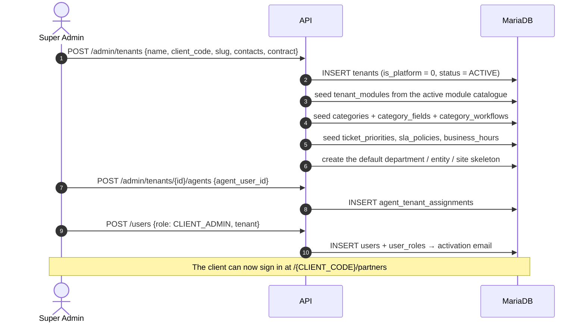
```mermaid
sequenceDiagram
    autonumber
    actor SA as Super Admin
    participant API
    participant DB as MariaDB

    SA->>API: POST /admin/tenants {name, client_code, slug, contacts, contract}
    API->>DB: INSERT tenants (is_platform = 0, status = ACTIVE)
    API->>DB: seed tenant_modules from the active module catalogue
    API->>DB: seed categories + category_fields + category_workflows
    API->>DB: seed ticket_priorities, sla_policies, business_hours
    API->>DB: create the default department / entity / site skeleton
    SA->>API: POST /admin/tenants/{id}/agents {agent_user_id}
    API->>DB: INSERT agent_tenant_assignments
    SA->>API: POST /users {role: CLIENT_ADMIN, tenant}
    API->>DB: INSERT users + user_roles → activation email
    Note over SA,DB: The client can now sign in at /{CLIENT_CODE}/partners
```

A client is a **tenant with `is_platform = 0`**. The catalogue is copied per
client rather than shared, which is what lets one client retire a query type or
add a priority level without a release and without affecting anyone else.

---

## 2. Client → Department → Entity → Site

This is the spine of the product. Everything routes along it.

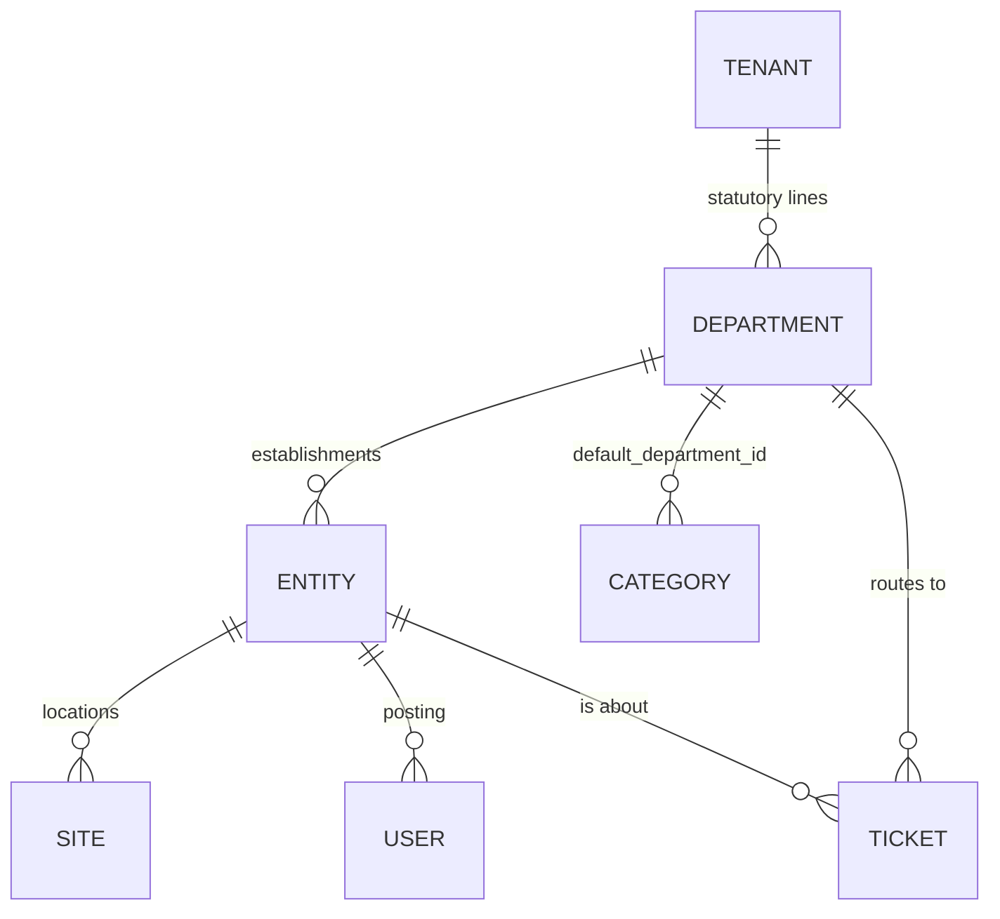
```mermaid
erDiagram
    TENANT ||--o{ DEPARTMENT : "statutory lines"
    DEPARTMENT ||--o{ ENTITY : "establishments"
    ENTITY ||--o{ SITE : "locations"
    ENTITY ||--o{ USER : "posting"
    DEPARTMENT ||--o{ CATEGORY : "default_department_id"
    DEPARTMENT ||--o{ TICKET : "routes to"
    ENTITY ||--o{ TICKET : "is about"
```

| Level | Means | Example |
|---|---|---|
| Client (tenant) | the customer company | Ampersand Group |
| Department | a statutory line | PF & Compliance, ESIC & Insurance |
| Entity | an establishment or query area within that line | Claim Status, EDLI, PF Withdrawals |
| Site | a physical location under an entity | Mumbai HO |

Two rules make the chain safe, and both are enforced server-side as well as in
the form:

- an entity belongs to exactly one department (`entities.department_id`);
- a ticket's `entity_id` and `department_id` must agree — the server reads the
  department off the entity row rather than trusting the request, and derives it
  when only the entity was named.

---

## 3. User registration and onboarding

Three ways in, one resulting account.

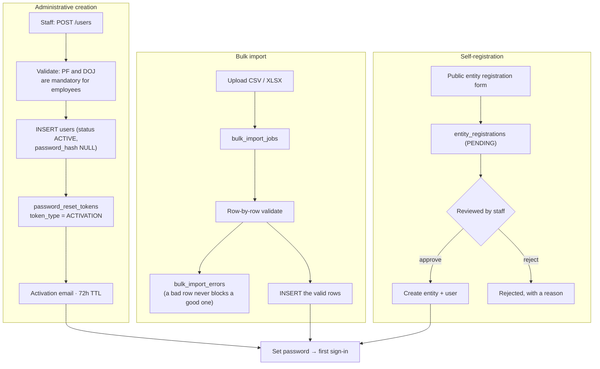
```mermaid
flowchart TB
    subgraph A["Administrative creation"]
        A1["Staff: POST /users"] --> A2["Validate: PF and DOJ<br/>are mandatory for employees"]
        A2 --> A3["INSERT users (status ACTIVE,<br/>password_hash NULL)"]
        A3 --> A4["password_reset_tokens<br/>token_type = ACTIVATION"]
        A4 --> A5["Activation email · 72h TTL"]
    end

    subgraph B["Bulk import"]
        B1["Upload CSV / XLSX"] --> B2["bulk_import_jobs"]
        B2 --> B3["Row-by-row validate"]
        B3 --> B4["bulk_import_errors<br/>(a bad row never blocks a good one)"]
        B3 --> B5["INSERT the valid rows"]
    end

    subgraph C["Self-registration"]
        C1["Public entity registration form"] --> C2["entity_registrations (PENDING)"]
        C2 --> C3{"Reviewed by staff"}
        C3 -- approve --> C4["Create entity + user"]
        C3 -- reject --> C5["Rejected, with a reason"]
    end

    A5 --> S["Set password → first sign-in"]
    B5 --> S
    C4 --> S
```

**PF Number and Date of Joining are mandatory for an employee**, because a PF
query cannot be worked without them. The create form blocks with a deep link to
the profile rather than letting the server reject a completed form.

---

## 4. Login, sessions and 2FA

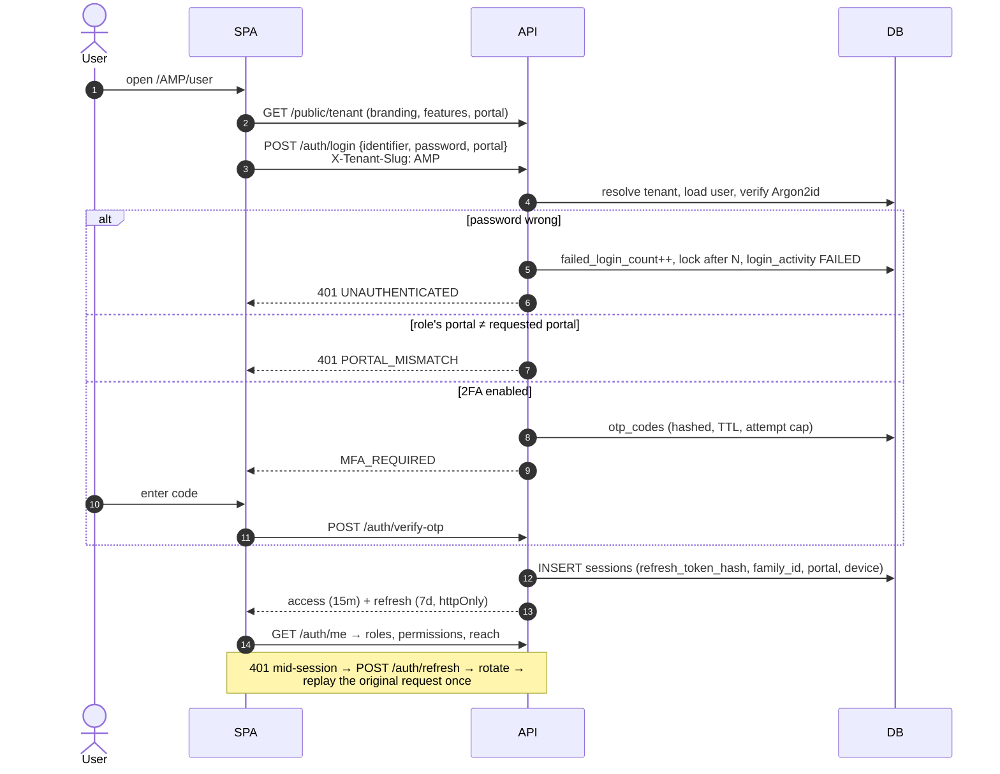
```mermaid
sequenceDiagram
    autonumber
    actor U as User
    participant SPA
    participant API
    participant DB

    U->>SPA: open /AMP/user
    SPA->>API: GET /public/tenant  (branding, features, portal)
    SPA->>API: POST /auth/login {identifier, password, portal}<br/>X-Tenant-Slug: AMP
    API->>DB: resolve tenant, load user, verify Argon2id
    alt password wrong
        API->>DB: failed_login_count++, lock after N, login_activity FAILED
        API-->>SPA: 401 UNAUTHENTICATED
    else role's portal ≠ requested portal
        API-->>SPA: 401 PORTAL_MISMATCH
    else 2FA enabled
        API->>DB: otp_codes (hashed, TTL, attempt cap)
        API-->>SPA: MFA_REQUIRED
        U->>SPA: enter code
        SPA->>API: POST /auth/verify-otp
    end
    API->>DB: INSERT sessions (refresh_token_hash, family_id, portal, device)
    API-->>SPA: access (15m) + refresh (7d, httpOnly)
    SPA->>API: GET /auth/me → roles, permissions, reach
    Note over SPA,API: 401 mid-session → POST /auth/refresh → rotate →<br/>replay the original request once
```

Refresh rotation is family-based: presenting an already-rotated token revokes
the whole family, which is the standard detection for a stolen refresh token.

---

## 5. RBAC and permission resolution

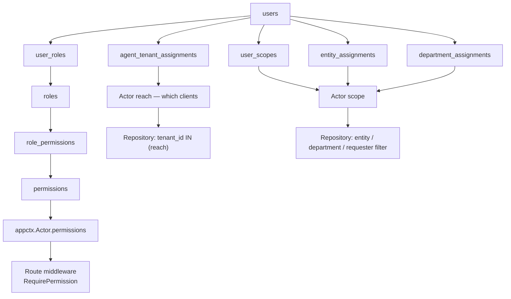
```mermaid
flowchart TB
    U["users"] --> UR["user_roles"] --> RO["roles"] --> RP["role_permissions"] --> P["permissions"]
    U --> US["user_scopes"]
    U --> EA["entity_assignments"]
    U --> DA["department_assignments"]
    U --> ATA["agent_tenant_assignments"]

    P --> ACT["appctx.Actor.permissions"]
    US & EA & DA --> SC["Actor scope"]
    ATA --> RCH["Actor reach — which clients"]

    ACT --> G1["Route middleware<br/>RequirePermission"]
    RCH --> G2["Repository: tenant_id IN (reach)"]
    SC --> G3["Repository: entity / department / requester filter"]
```

| Group | Keys |
|---|---|
| Tickets | `ticket.view.own`, `ticket.view.scope`, `ticket.view.all`, `ticket.create`, `ticket.update`, `ticket.assign`, `ticket.transfer`, `ticket.escalate`, `ticket.status.change`, `ticket.close`, `ticket.cancel`, `ticket.reopen`, `ticket.reply.public`, `ticket.reply.internal`, `ticket.watch`, `ticket.moderate`, `ticket.bulk`, `ticket.export`, `ticket.feedback` |
| Users | `user.view.all`, `user.view.scope`, `user.view.pii`, `user.create`, `user.update`, `user.delete`, `user.bulk_import`, `user.send_reset`, `user.move_group`, `user.impersonate` |
| Documents | `document.view`, `document.upload`, `document.download`, `document.version`, `document.delete` |
| Configuration | `config.category`, `config.workflow`, `config.sla`, `config.routing`, `config.role`, `config.org`, `config.branding`, `config.notification`, `config.settings`, `config.feature`, `config.group`, `config.apikey`, `org.*` |
| Platform | `client.onboard`, `agent.assign`, `agent.view`, `module.*`, `tenant.manage`, `tenant.maintenance` |
| Reports | `dashboard.view`, `report.view`, `report.custom`, `report.export`, `report.schedule` |
| Audit | `audit.view`, `audit.export`, `analytics.view` |
| Client | `client.view`, `client.create`, `client.update`, `client.delete`, `client.purge`, `partner_executive.create` |
| Help | `help.view`, `help.reply`, `help.manage` |

Roles ship as system roles (`roles.tenant_id IS NULL`) and a client may define
its own. `roles.portal` decides which portal a role may sign in to.

---

## 6. User management

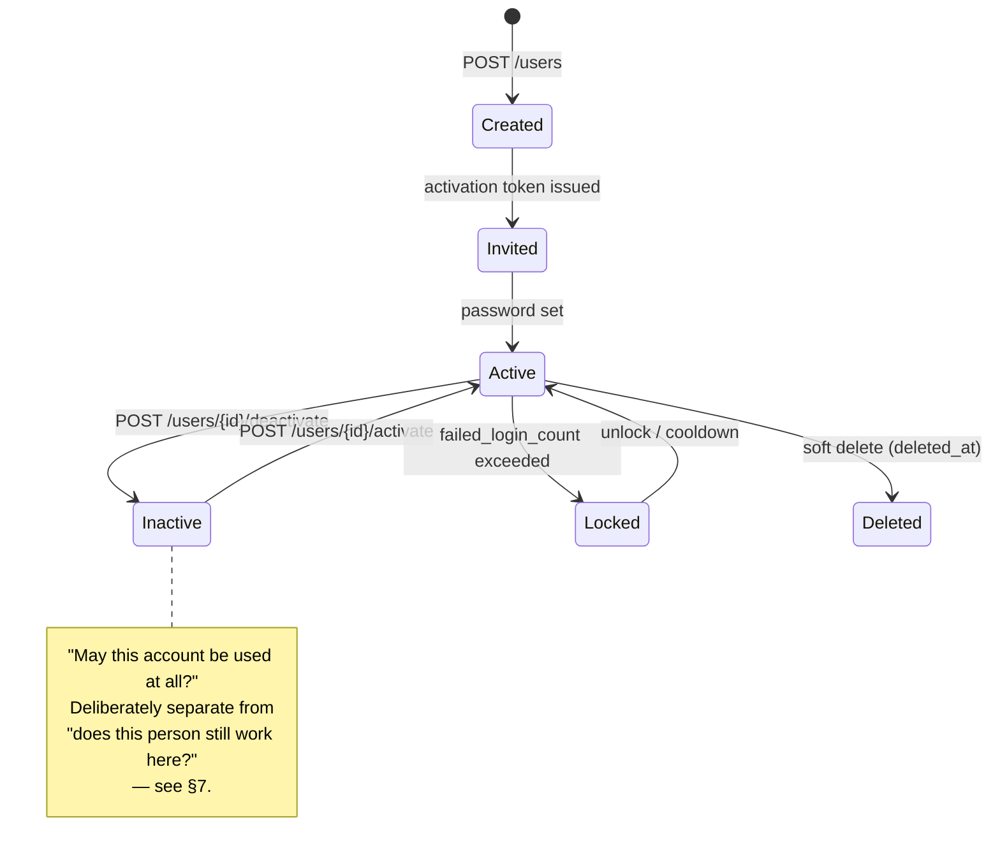
```mermaid
stateDiagram-v2
    [*] --> Created: POST /users
    Created --> Invited: activation token issued
    Invited --> Active: password set
    Active --> Inactive: POST /users/{id}/deactivate
    Inactive --> Active: POST /users/{id}/activate
    Active --> Locked: failed_login_count exceeded
    Locked --> Active: unlock / cooldown
    Active --> Deleted: soft delete (deleted_at)
    note right of Inactive
        "May this account be used at all?"
        Deliberately separate from
        "does this person still work here?"
        — see §7.
    end note
```

Assignment surfaces that hang off a user:

| Surface | Table | Effect |
|---|---|---|
| Roles | `user_roles` | permissions and portal |
| Client coverage (staff) | `agent_tenant_assignments` | which clients an agent reaches |
| Departments | `department_assignments` | which statutory lines an agent works |
| Entities | `entity_assignments` | which establishments a partner oversees; `can_reply` grants reply rights per entity |
| Sites | `site_assignments` | location-level scope |
| Groups | `user_groups` + `user_group_transfers` | bulk scope and SLA banding |

---

## 7. Employee lifecycle — Active ⇄ Ex-employee

Two questions, two endpoints, deliberately not one switch.

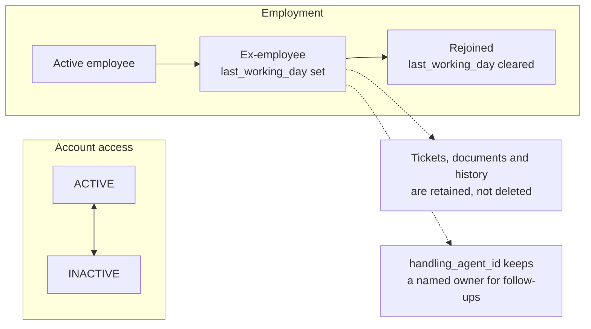
```mermaid
flowchart LR
    subgraph Q1["Account access"]
        AC["ACTIVE"] <--> IN["INACTIVE"]
    end
    subgraph Q2["Employment"]
        EM["Active employee"] --> EX["Ex-employee<br/>last_working_day set"]
        EX --> EM2["Rejoined<br/>last_working_day cleared"]
    end

    EX -.-> KEEP["Tickets, documents and history<br/>are retained, not deleted"]
    EX -.-> HA["handling_agent_id keeps<br/>a named owner for follow-ups"]
```

Collapsing them into one control is what made "Activate" on an ex-employee
silently erase the fact that they had left. An ex-employee frequently still has
live PF and ESIC claims — the record has to survive the departure, and the date
of the departure is often exactly what the claim turns on.

---

## 8. Raising a ticket

Two questions, in the order the organisation is shaped.

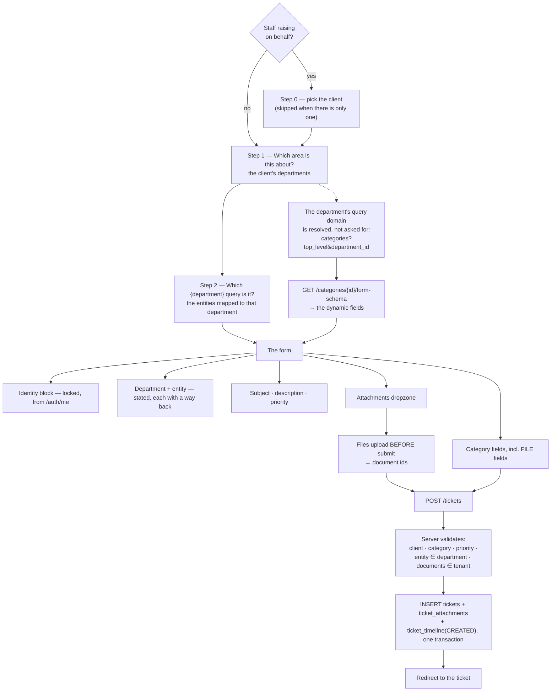
```mermaid
flowchart TB
    S0{"Staff raising<br/>on behalf?"} -- yes --> S1["Step 0 — pick the client<br/>(skipped when there is only one)"]
    S0 -- no --> S2
    S1 --> S2["Step 1 — Which area is this about?<br/>the client's departments"]
    S2 --> S3["Step 2 — Which {department} query is it?<br/>the entities mapped to that department"]
    S3 --> S4["The form"]

    S2 -.-> RES["The department's query domain<br/>is resolved, not asked for:<br/>categories?top_level&department_id"]
    RES --> SCH["GET /categories/{id}/form-schema<br/>→ the dynamic fields"]
    SCH --> S4

    S4 --> F1["Identity block — locked, from /auth/me"]
    S4 --> F2["Department + entity — stated, each with a way back"]
    S4 --> F3["Subject · description · priority"]
    S4 --> F4["Category fields, incl. FILE fields"]
    S4 --> F5["Attachments dropzone"]
    F5 --> UP["Files upload BEFORE submit<br/>→ document ids"]
    UP --> SUB["POST /tickets"]
    F4 --> SUB
    SUB --> V["Server validates:<br/>client · category · priority ·<br/>entity ∈ department · documents ∈ tenant"]
    V --> CR["INSERT tickets + ticket_attachments<br/>+ ticket_timeline(CREATED), one transaction"]
    CR --> NAV["Redirect to the ticket"]
```

Notes that are easy to get wrong:

- **A query-domain step used to sit between the two.** With the catalogue
  filtered by department it offered exactly one card, so it asked the requester
  to re-answer the question they had just answered. It is gone; the domain is
  resolved from the department.
- **Attachments upload before submit**, so a rejected create never orphans
  files — and the idempotency key is regenerated on failure so a retry cannot
  create a second ticket.
- **Both halves of the form produce attachments.** The dropzone at the foot and
  the category's own FILE fields are linked identically — see §14.
- **The draft is autosaved silently.** It used to announce "Draft saved
  automatically" beside the submit button, which read as a state the requester
  had to manage rather than the safety net it is.

---

## 9. Ticket status lifecycle

Five states, plus a withdrawal that is not a stage of the work.

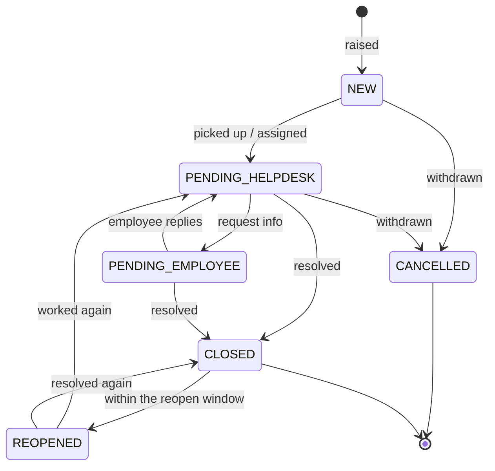
```mermaid
stateDiagram-v2
    [*] --> NEW: raised
    NEW --> PENDING_HELPDESK: picked up / assigned
    PENDING_HELPDESK --> PENDING_EMPLOYEE: request info
    PENDING_EMPLOYEE --> PENDING_HELPDESK: employee replies
    PENDING_HELPDESK --> CLOSED: resolved
    PENDING_EMPLOYEE --> CLOSED: resolved
    CLOSED --> REOPENED: within the reopen window
    REOPENED --> PENDING_HELPDESK: worked again
    REOPENED --> CLOSED: resolved again
    NEW --> CANCELLED: withdrawn
    PENDING_HELPDESK --> CANCELLED: withdrawn
    CANCELLED --> [*]
    CLOSED --> [*]
```

| Status | Means | SLA clock |
|---|---|---|
| `NEW` | nobody has looked at it | first-response running |
| `PENDING_HELPDESK` | with the department | resolution running |
| `PENDING_EMPLOYEE` | waiting on the client or employee | **paused** |
| `CLOSED` | done (`resolved_at` and `closed_at` stamped) | stopped |
| `REOPENED` | done, and then it wasn't | resolution running again |
| `CANCELLED` | withdrawn — a record, never a deletion | stopped |

The moves are **data**, not code: `category_workflows` holds
`(from_status, to_status, allowed_roles, requires_comment, requires_reason_code,
reason_codes)`, and `GET /tickets/{id}` returns the caller's legal moves as
`allowed_transitions`.

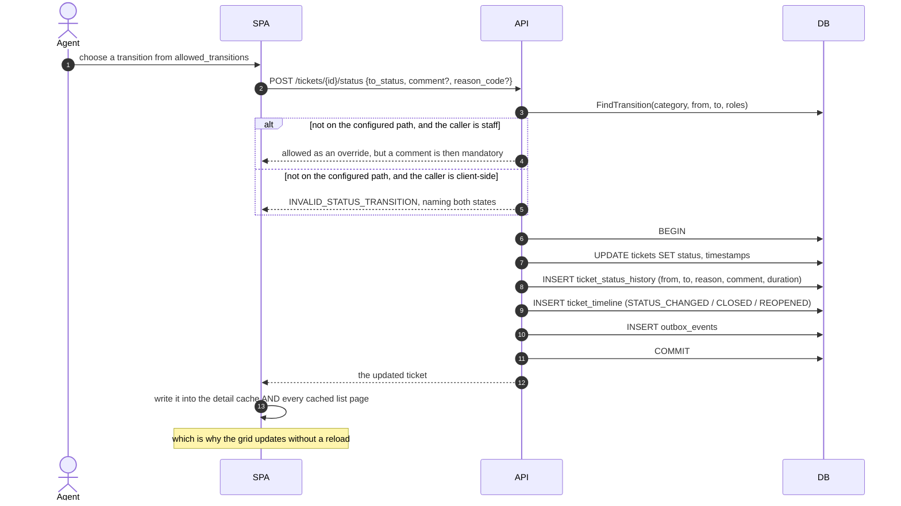
```mermaid
sequenceDiagram
    autonumber
    actor A as Agent
    participant SPA
    participant API
    participant DB

    A->>SPA: choose a transition from allowed_transitions
    SPA->>API: POST /tickets/{id}/status {to_status, comment?, reason_code?}
    API->>DB: FindTransition(category, from, to, roles)
    alt not on the configured path, and the caller is staff
        API-->>SPA: allowed as an override, but a comment is then mandatory
    else not on the configured path, and the caller is client-side
        API-->>SPA: INVALID_STATUS_TRANSITION, naming both states
    end
    API->>DB: BEGIN
    API->>DB: UPDATE tickets SET status, timestamps
    API->>DB: INSERT ticket_status_history (from, to, reason, comment, duration)
    API->>DB: INSERT ticket_timeline (STATUS_CHANGED / CLOSED / REOPENED)
    API->>DB: INSERT outbox_events
    API->>DB: COMMIT
    API-->>SPA: the updated ticket
    SPA->>SPA: write it into the detail cache AND every cached list page
    Note over SPA: which is why the grid updates without a reload
```

**Reopen** is available to the employee who raised the ticket, within the
client's configured window counted from `resolved_at`. Past the window the API
answers `REOPEN_WINDOW_EXPIRED` and names the new-ticket route instead.

---

## 10. Assignment and transfer

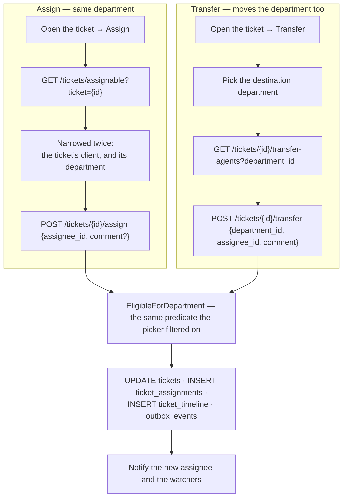
```mermaid
flowchart TB
    subgraph Assign["Assign — same department"]
        A1["Open the ticket → Assign"] --> A2["GET /tickets/assignable?ticket={id}"]
        A2 --> A3["Narrowed twice:<br/>the ticket's client, and its department"]
        A3 --> A4["POST /tickets/{id}/assign {assignee_id, comment?}"]
    end

    subgraph Transfer["Transfer — moves the department too"]
        T1["Open the ticket → Transfer"] --> T2["Pick the destination department"]
        T2 --> T3["GET /tickets/{id}/transfer-agents?department_id="]
        T3 --> T4["POST /tickets/{id}/transfer {department_id, assignee_id, comment}"]
    end

    A4 & T4 --> V["EligibleForDepartment — the same predicate the picker filtered on"]
    V --> W["UPDATE tickets · INSERT ticket_assignments ·<br/>INSERT ticket_timeline · outbox_events"]
    W --> N["Notify the new assignee and the watchers"]
```

**Who may be handed a ticket in a department** — one rule, `user.worksDepartment`,
used by both the picker and the endpoint:

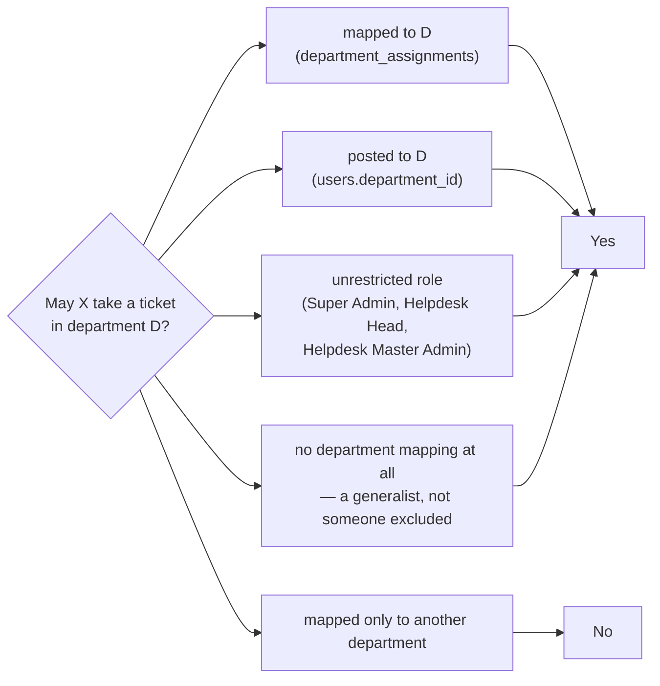
```mermaid
flowchart LR
    Q{"May X take a ticket<br/>in department D?"} --> C1["mapped to D<br/>(department_assignments)"]
    Q --> C2["posted to D<br/>(users.department_id)"]
    Q --> C3["unrestricted role<br/>(Super Admin, Helpdesk Head,<br/>Helpdesk Master Admin)"]
    Q --> C4["no department mapping at all<br/>— a generalist, not someone excluded"]
    C1 & C2 & C3 & C4 --> Y["Yes"]
    Q --> C5["mapped only to another department"] --> N["No"]
```

The fourth branch is the one worth stating: **no mapping means unrestricted, not
restricted.** It is the desk's default state before anybody has been allocated,
and treating it as "excluded" would empty the picker on a fresh client.

The rule is written once because it was previously written twice and the two
disagreed: the assign picker offered every agent on every ticket and the API
refused most of them, while the transfer picker demanded an explicit mapping and
so hid every generalist.

Additional guards on transfer:

- department and agent must agree, checked against the record;
- transferring to the department and agent it already sits with is refused with
  `NO_CHANGE` — it would record an action and notify people while changing
  nothing.

---

## 11. Escalation

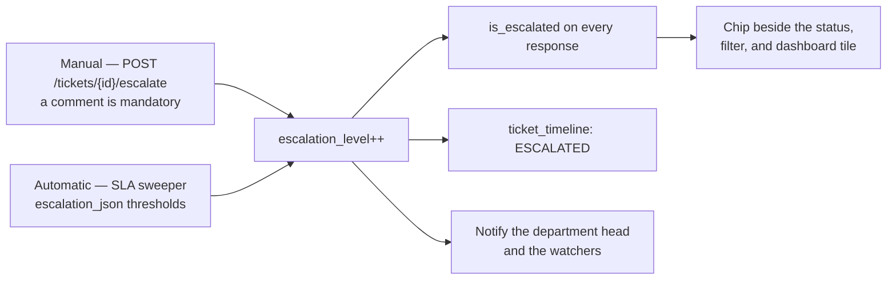
```mermaid
flowchart LR
    M["Manual — POST /tickets/{id}/escalate<br/>a comment is mandatory"] --> E
    S["Automatic — SLA sweeper<br/>escalation_json thresholds"] --> E
    E["escalation_level++"] --> F["is_escalated on every response"]
    F --> UI["Chip beside the status,<br/>filter, and dashboard tile"]
    E --> TL["ticket_timeline: ESCALATED"]
    E --> NT["Notify the department head<br/>and the watchers"]
```

**Escalation is a flag alongside the status, not a replacement for it.** It used
to overwrite the status with `ESCALATED`, which destroyed the information the
board is worked from: a ticket waiting on the employee and a ticket waiting on
the desk both became "Escalated" and nobody could tell what either was waiting
for. Urgency and stage are two different questions and the answer to one must
not erase the other.

A manual escalation always requires a reason — it is a claim on somebody else's
attention, and one with no stated reason gives the person picking it up nothing
to act on.

---

## 12. Priority

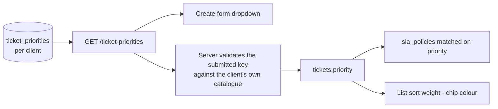
```mermaid
flowchart LR
    CAT[("ticket_priorities<br/>per client")] --> API["GET /ticket-priorities"]
    API --> FORM["Create form dropdown"]
    API --> V["Server validates the submitted key<br/>against the client's own catalogue"]
    V --> T["tickets.priority"]
    T --> SLA["sla_policies matched on priority"]
    T --> SORT["List sort weight · chip colour"]
```

Priority is a **catalogue, not an enum**: a client that adds "Statutory
deadline" gets it in the form without a release, and one that retires a level
stops being offered it — while the API still refuses a key that client does not
have. `is_default` seeds the form; `weight` orders the list.

---

## 13. Watchers

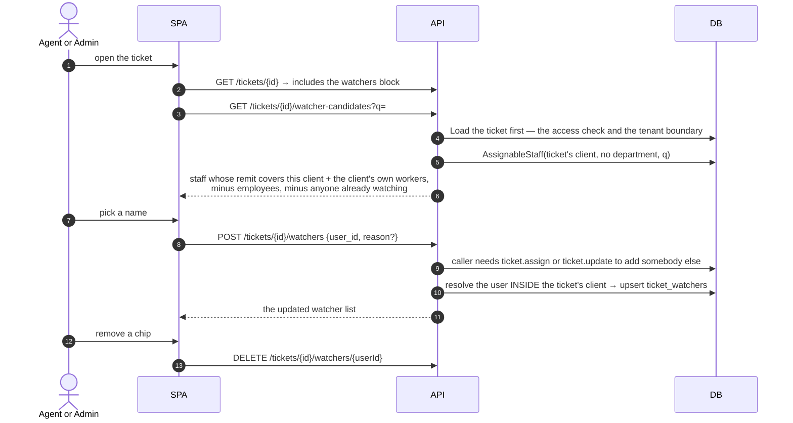
```mermaid
sequenceDiagram
    autonumber
    actor A as Agent or Admin
    participant SPA
    participant API
    participant DB

    A->>SPA: open the ticket
    SPA->>API: GET /tickets/{id}  → includes the watchers block
    SPA->>API: GET /tickets/{id}/watcher-candidates?q=
    API->>DB: Load the ticket first — the access check and the tenant boundary
    API->>DB: AssignableStaff(ticket's client, no department, q)
    API-->>SPA: staff whose remit covers this client + the client's own workers,<br/>minus employees, minus anyone already watching
    A->>SPA: pick a name
    SPA->>API: POST /tickets/{id}/watchers {user_id, reason?}
    API->>DB: caller needs ticket.assign or ticket.update to add somebody else
    API->>DB: resolve the user INSIDE the ticket's client → upsert ticket_watchers
    API-->>SPA: the updated watcher list
    A->>SPA: remove a chip
    SPA->>API: DELETE /tickets/{id}/watchers/{userId}
```

Rules:

- **Anyone who can see a ticket may watch it themselves.** Adding *somebody
  else* is an act of assignment — it puts the ticket on their radar and sends
  them its notifications — and needs `ticket.assign` or `ticket.update`.
- **Candidates are resolved inside the ticket's own client**, so a watcher can
  never be somebody who would then be unable to open what they are watching, and
  a name from another tenant cannot appear in the list to be picked.
- **Employees are excluded**: one employee following another's PF query is a
  disclosure, not a feature.
- Removing yourself is always allowed; removing others needs the same grant as
  adding them. `can_remove` on each row is the server's answer, so the UI does
  not re-derive the rule.

---

## 14. Supporting documents

The full path, and the two places a file can enter from.

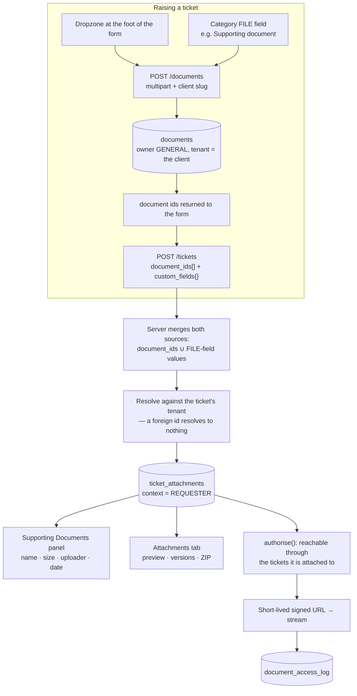
```mermaid
flowchart TB
    subgraph Create["Raising a ticket"]
        D1["Dropzone at the foot of the form"] --> U["POST /documents<br/>multipart + client slug"]
        D2["Category FILE field<br/>e.g. Supporting document"] --> U
        U --> DOC[("documents<br/>owner GENERAL, tenant = the client")]
        DOC --> IDS["document ids returned to the form"]
        IDS --> P["POST /tickets<br/>document_ids[] + custom_fields{}"]
    end

    P --> M["Server merges both sources:<br/>document_ids ∪ FILE-field values"]
    M --> RES["Resolve against the ticket's tenant<br/>— a foreign id resolves to nothing"]
    RES --> LINK[("ticket_attachments<br/>context = REQUESTER")]

    LINK --> VIEW["Supporting Documents panel<br/>name · size · uploader · date"]
    LINK --> TAB["Attachments tab<br/>preview · versions · ZIP"]
    LINK --> AUTH["authorise(): reachable through<br/>the tickets it is attached to"]
    AUTH --> SIGN["Short-lived signed URL → stream"]
    SIGN --> LOG[("document_access_log")]
```

**Why linking is not cosmetic.** A document's read authorisation is *"is it
attached to a ticket the caller may open?"*. A file uploaded but never linked is
authorised against an empty set of tickets, so it is unreachable by anybody
except its uploader — which is exactly what happened to every file put into a
category FILE field. The row existed, the bytes were on disk, and the ticket
displayed a 26-character identifier where a filename should have been.

The fix is in `internal/ticket/repository_form_files.go` for new tickets and
migration `000025` for the ones raised before it. The FILE field's value is no
longer printed in the custom-field list, because the file itself is now listed
where it has a name and a way to open it.

Documents survive every lifecycle action — status change, transfer, assignment,
escalation, close, reopen — because nothing in those paths touches
`ticket_attachments`.

---

## 15. Activity timeline

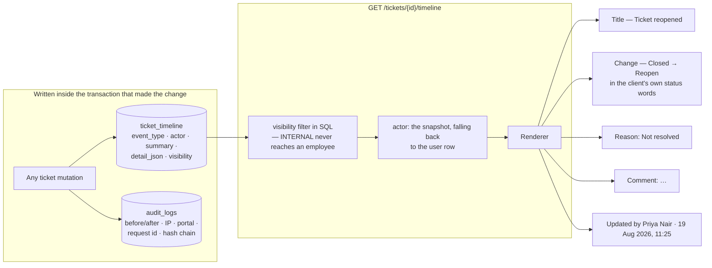
```mermaid
flowchart LR
    subgraph Write["Written inside the transaction that made the change"]
        CH["Any ticket mutation"] --> TL[("ticket_timeline<br/>event_type · actor · summary ·<br/>detail_json · visibility")]
        CH --> AL[("audit_logs<br/>before/after · IP · portal ·<br/>request id · hash chain")]
    end

    subgraph Read["GET /tickets/{id}/timeline"]
        TL --> FIL["visibility filter in SQL<br/>— INTERNAL never reaches an employee"]
        FIL --> ACT["actor: the snapshot, falling back<br/>to the user row"]
        ACT --> UI["Renderer"]
    end

    UI --> O1["Title — Ticket reopened"]
    UI --> O2["Change — Closed → Reopen<br/>in the client's own status words"]
    UI --> O3["Reason: Not resolved"]
    UI --> O4["Comment: …"]
    UI --> O5["Updated by Priya Nair · 19 Aug 2026, 11:25"]
```

The stored record and the presented record are deliberately different things.
The timeline used to render the payload as it stood — `Before PENDING_HELPDESK /
After PENDING_EMPLOYEE` over a `{"comment": "…"}` block — which is accurate and
unreadable by the employee whose ticket it is. Now:

- status codes are translated through the client's own status vocabulary;
- reason codes are humanised (`NOT_RESOLVED` → "Not resolved");
- the comment is labelled prose;
- assignment events name the people and departments involved, and only the ones
  that actually changed;
- an unrecognised key degrades to a labelled row, never to a JSON dump;
- the actor and the full timestamp are always shown.

The technical record is untouched: `audit_logs` still holds before/after, the
raw payload, IP, user agent, portal and request id.

Event types: `CREATED`, `STATUS_CHANGED`, `ASSIGNED`, `TRANSFERRED`,
`ESCALATED`, `REPLIED`, `INTERNAL_NOTE`, `ATTACHMENT_ADDED`,
`ATTACHMENT_DOWNLOADED`, `INFO_REQUESTED`, `SLA_WARNING`, `SLA_BREACHED`,
`REOPENED`, `CLOSED`, `FEEDBACK_GIVEN`, `FIELD_UPDATED`.

---

## 16. SLA

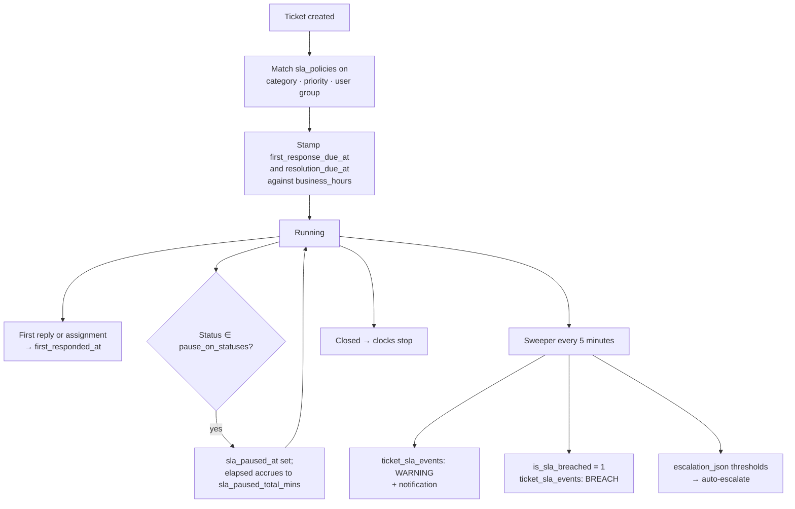
```mermaid
flowchart TB
    C["Ticket created"] --> M["Match sla_policies on<br/>category · priority · user group"]
    M --> DUE["Stamp first_response_due_at<br/>and resolution_due_at<br/>against business_hours"]
    DUE --> RUN["Running"]
    RUN --> FR["First reply or assignment<br/>→ first_responded_at"]
    RUN --> PA{"Status ∈ pause_on_statuses?"}
    PA -- yes --> P["sla_paused_at set;<br/>elapsed accrues to sla_paused_total_mins"]
    P --> RUN
    RUN --> SW["Sweeper every 5 minutes"]
    SW --> WARN["ticket_sla_events: WARNING<br/>+ notification"]
    SW --> BR["is_sla_breached = 1<br/>ticket_sla_events: BREACH"]
    SW --> ESC["escalation_json thresholds<br/>→ auto-escalate"]
    RUN --> DONE["Closed → clocks stop"]
```

Business hours and holidays are per client, so "4 working hours" means what the
contract says rather than four wall-clock hours. `ticket_sla_events` is unique
per `(ticket, event, level)`, which is what makes the sweeper safe to run on
every instance.

---

## 17. Notifications

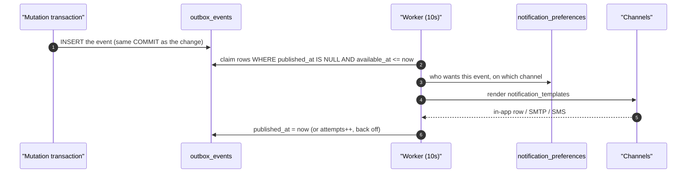
```mermaid
sequenceDiagram
    autonumber
    participant TX as "Mutation transaction"
    participant OB as outbox_events
    participant WK as "Worker (10s)"
    participant PR as notification_preferences
    participant CH as "Channels"

    TX->>OB: INSERT the event (same COMMIT as the change)
    WK->>OB: claim rows WHERE published_at IS NULL AND available_at <= now
    WK->>PR: who wants this event, on which channel
    WK->>CH: render notification_templates
    CH-->>WK: in-app row / SMTP / SMS
    WK->>OB: published_at = now  (or attempts++, back off)
```

Recipients of a ticket event: the requester, the assignee, the department head,
and **every watcher**. Per-user, per-event, per-channel preferences decide what
is actually delivered; the in-app row is always written so the bell is complete.

Separately and synchronously, a WebSocket message names the changed ticket so
open browsers invalidate the matching cache tags. It carries no data — see
[ARCHITECTURE.md §9](ARCHITECTURE.md#9-notifications-and-realtime).

---

## 18. Dashboards and reporting

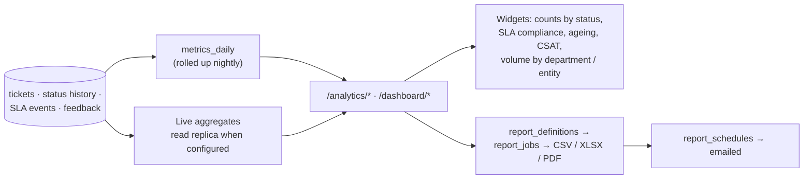
```mermaid
flowchart LR
    T[("tickets · status history ·<br/>SLA events · feedback")] --> AGG["metrics_daily<br/>(rolled up nightly)"]
    T --> LIVE["Live aggregates<br/>read replica when configured"]
    AGG & LIVE --> API["/analytics/*  ·  /dashboard/*"]
    API --> W["Widgets: counts by status,<br/>SLA compliance, ageing, CSAT,<br/>volume by department / entity"]
    API --> RPT["report_definitions →<br/>report_jobs → CSV / XLSX / PDF"]
    RPT --> SCH["report_schedules → emailed"]
```

Every dashboard query is scoped by the same reach and scope rules as the ticket
list, so a partner's chart counts only their entities' tickets. Reporting reads
from the replica when one is configured, so a heavy export cannot slow the desk.

---

## 19. Role workflows end to end

```mermaid
flowchart TB
    subgraph EMP["Employee — /{CODE}/user"]
        E1["Raise a ticket"] --> E2["Track status"] --> E3["Reply, attach"] --> E4["Reopen within the window"] --> E5["Rate the resolution"]
    end
    subgraph PTR["Partner — /{CODE}/partners"]
        P1["See their entities' tickets"] --> P2["Raise on behalf of an employee"] --> P3["Reply where can_reply is granted"] --> P4["Watch · export · dashboards"]
    end
    subgraph AGT["Agent — /agents"]
        G1["Queue for their clients and departments"] --> G2["Assign / accept"] --> G3["Reply, internal notes"] --> G4["Request info · transfer · escalate"] --> G5["Close"]
    end
    subgraph ADM["Admin — /admin"]
        A1["Onboard clients"] --> A2["Users, roles, agent coverage"] --> A3["Catalogue, workflow, SLA, routing"] --> A4["Audit, analytics, maintenance"]
    end

    E1 --> G1
    P2 --> G1
    G5 --> E5
```

---

## 20. Error handling and validation

```mermaid
flowchart TB
    IN["Request"] --> L1["Layer 1 — transport<br/>body size, content type, timeout"]
    L1 --> L2["Layer 2 — binding<br/>struct tags: required, len, max, safetext"]
    L2 -- fails --> VE["422 VALIDATION_FAILED<br/>details[]: {field, code, message}"]
    L2 --> L3["Layer 3 — authorisation<br/>permission → reach → scope"]
    L3 -- fails --> AE["403 FORBIDDEN, or 404 NOT_FOUND<br/>where existence is itself a disclosure"]
    L3 --> L4["Layer 4 — domain rules<br/>transitions, windows, department agreement"]
    L4 -- fails --> DE["409 / 422 with a named code<br/>and a message a person can act on"]
    L4 --> L5["Layer 5 — persistence<br/>one transaction per action"]
    L5 -- fails --> IE["500 INTERNAL<br/>logged with request_id, never leaked"]
    L5 --> OK["200 / 201 + the updated record"]

    VE & AE & DE --> FE["SPA maps details[] onto the form fields;<br/>anything unmatched becomes a form-level message"]
```

The frontend mirrors it: zod checks the response shape in development and logs
drift without breaking the screen; `applyServerFieldErrors` puts a server
rejection on the exact control that caused it; and a create that failed
regenerates its idempotency key so the retry is a fresh attempt rather than a
replay.
